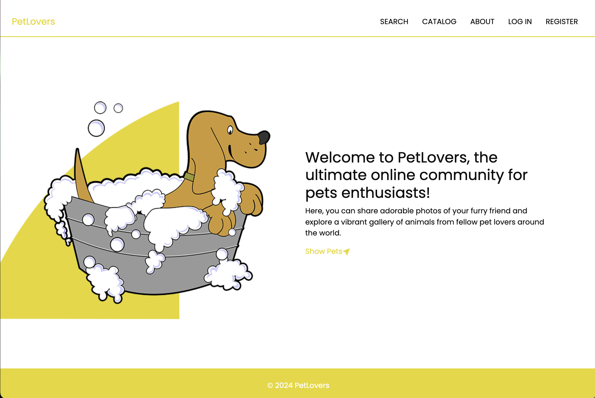
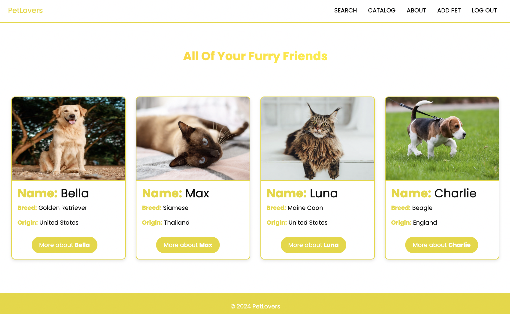
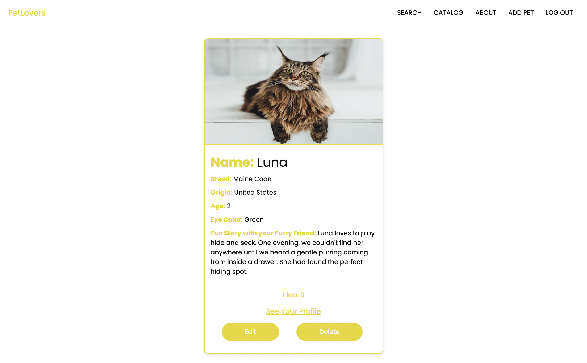
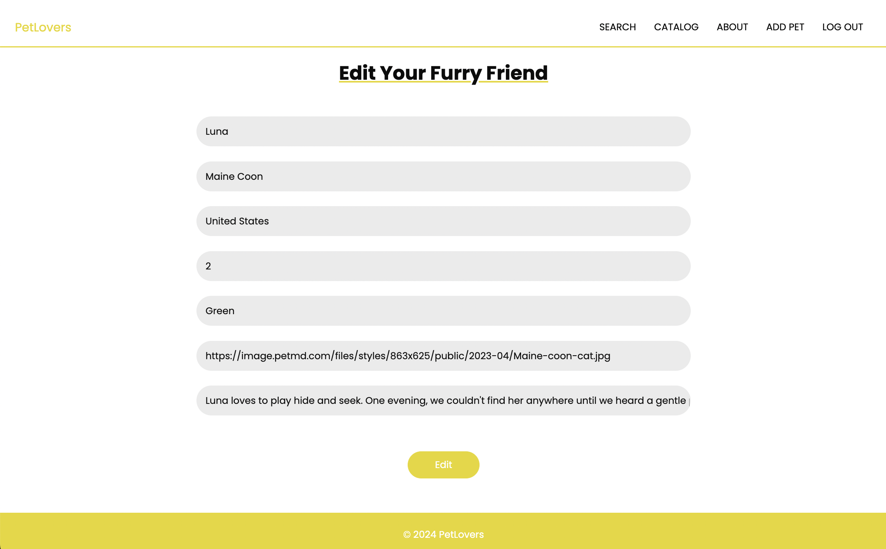
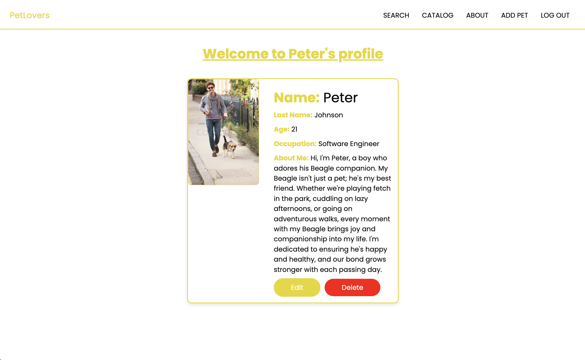
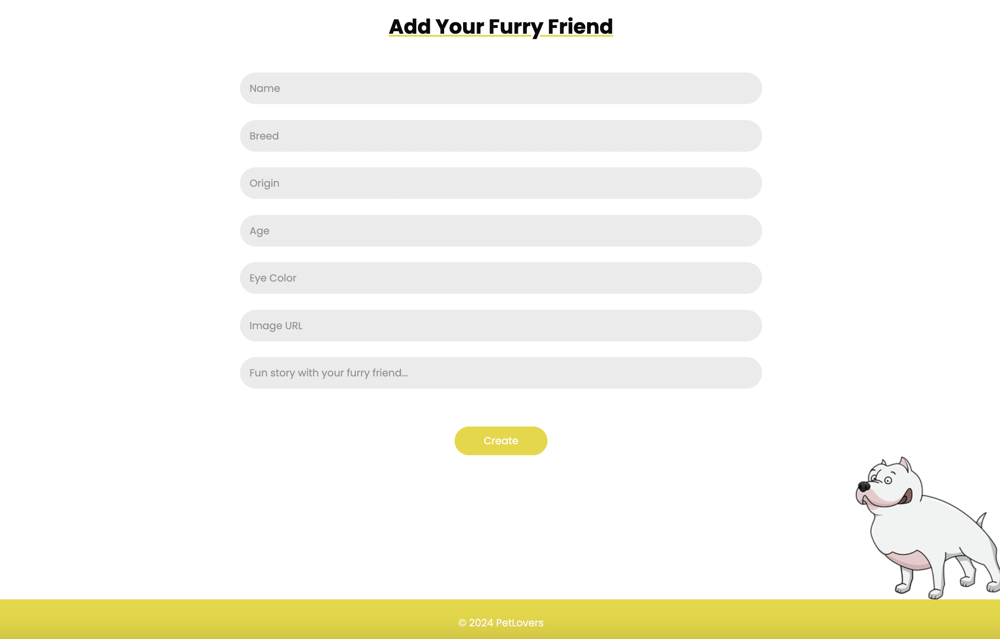
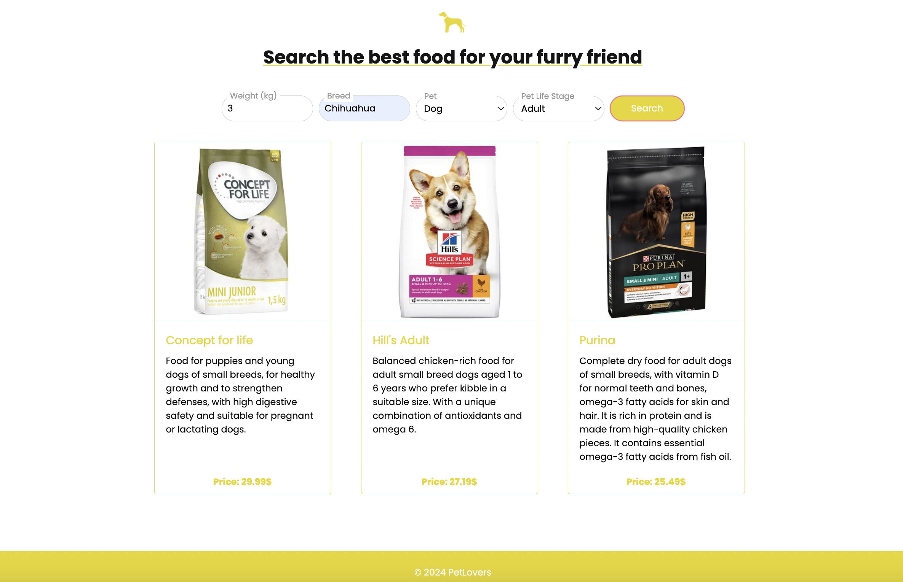
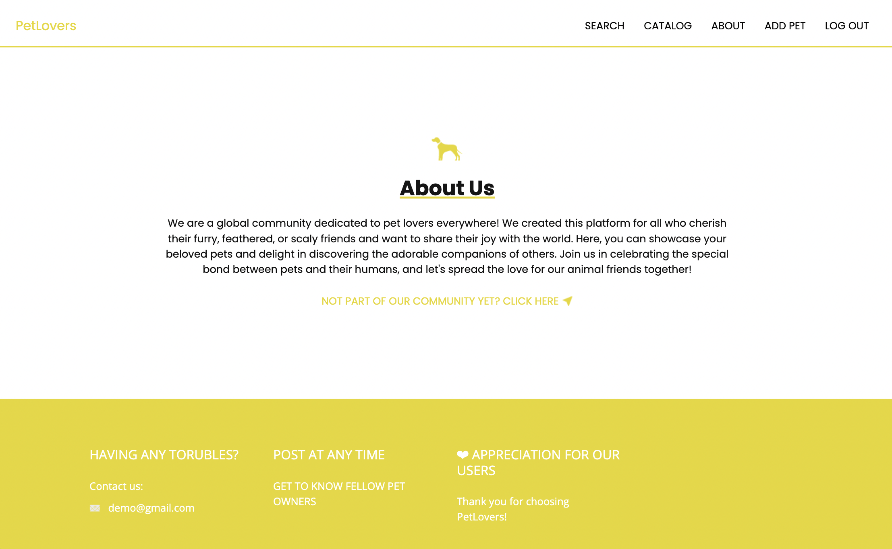

# PetLovers

PetLovers is a Single Page Application (SPA) built using React.js. It provides a platform for pet enthusiasts to share and interact with pets' profiles. Guests can browse pets and learn about the app, while registered users can like pets and manage their own pet and user profiles.

## Installation

1. Clone the repository:
   ```bash
   git clone https://github.com/victoriagopin/Pet-Lovers-React-Project.git
   cd Pet-Lovers-React-Project
2. Install dependencies for the client:
   ```bash
   cd client
   npm install
3. Starting the clinet
    ## Terminal 1
    ```bash
   npm run dev
3. Starting the Server
    ## Terminal 2
    ```bash
    cd server
    node server.js

- After you are finished with the installation go back to Terminal 1 and open the link.

## Features

- **Guest Users:**
  - View the Home Page
  - Browse all uploaded pets
  - Access the About Page
  - Register and Login

- **Registered Users:**
  - View pet details
  - Like pets
  - Create and manage a user profile
  - Create and manage pet profiles
  - Edit or delete their own posts
  - Search suitable foods for their pets

## Images











